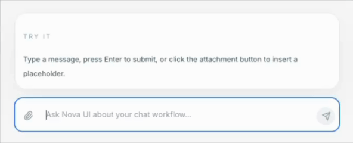

# nova-ui-react

[English](./README.md) | 中文

面向 AI 聊天场景的现代化 React UI 组件库，可直接用于生产环境。

## 为什么选择 Nova UI
- 默认样式精致，适合 AI 产品界面
- 内置 Markdown 与代码高亮渲染能力
- 适配流式输出交互体验
- 基于 TypeScript 与 Tailwind CSS 构建

## 组件列表
- `MessageBubble`：按角色显示气泡、支持 Markdown、代码高亮、思考过程折叠面板
- `ChatInput`：输入框自适应高度，Enter 发送、Shift+Enter 换行，支持停止与附件操作
- `TypingEffect`：打字机流式动画，支持结束回调

## 预览

### MessageBubble


### ChatInput



### TypingEffect


## 安装

```bash
npm install nova-ui-react
```

对等依赖：
- `react` `^18 || ^19`
- `react-dom` `^18 || ^19`

## 快速开始

```tsx
import { useState } from 'react';
import { MessageBubble, ChatInput } from 'nova-ui-react';
import 'nova-ui-react/dist/index.css';

export default function App() {
  const [value, setValue] = useState('');
  const [messages, setMessages] = useState([
    { role: 'ai' as const, content: '你好，我可以帮你做什么？' },
  ]);

  return (
    <div className="mx-auto max-w-3xl p-4">
      <div className="space-y-4">
        {messages.map((m, i) => (
          <MessageBubble key={i} role={m.role} content={m.content} />
        ))}
      </div>

      <div className="mt-4">
        <ChatInput
          value={value}
          onChange={setValue}
          onSubmit={(text) => {
            if (!text.trim()) return;
            setMessages((prev) => [...prev, { role: 'user', content: text }]);
            setValue('');
          }}
        />
      </div>
    </div>
  );
}
```

## Tailwind 配置

如果你的项目会严格裁剪样式，请确保 Tailwind 扫描到组件库产物：

```js
export default {
  content: [
    './src/**/*.{js,ts,jsx,tsx}',
    './node_modules/nova-ui-react/dist/**/*.{js,mjs}',
  ],
};
```

## 文档
- 英文：`docs/`
- 中文：`docs/zh/`

本地启动文档站：

```bash
cd docs
npm run docs:dev
```

## 本地开发

```bash
npm install
npm run lint
npm run typecheck
npm run build
```

## 发布

```bash
npm logout --registry=https://registry.npmjs.org/
npm login --auth-type=legacy --registry=https://registry.npmjs.org/
npm publish --access public --otp=123456
```

如果你的账号开启了发布 2FA，手动发布时必须带 `--otp`。  
如果是 CI/CD 发布，请使用具备 `publish` 权限且开启 2FA bypass 的 granular token。

### GitHub Actions 自动发布

仓库已内置 [npm-publish.yml](./.github/workflows/npm-publish.yml)：
- 推送标签（如 `v1.0.1`）时自动触发
- 支持在 Actions 页面手动触发（`workflow_dispatch`）
- 发布前自动执行 `lint`、`typecheck`、`build`

需要配置仓库 Secret：
- `NPM_TOKEN`：具备 `publish` 权限且开启 2FA bypass 的 npm granular token

通过标签发布：

```bash
git tag v1.0.1
git push origin v1.0.1
```

## 许可证

[MIT](./LICENSE)
